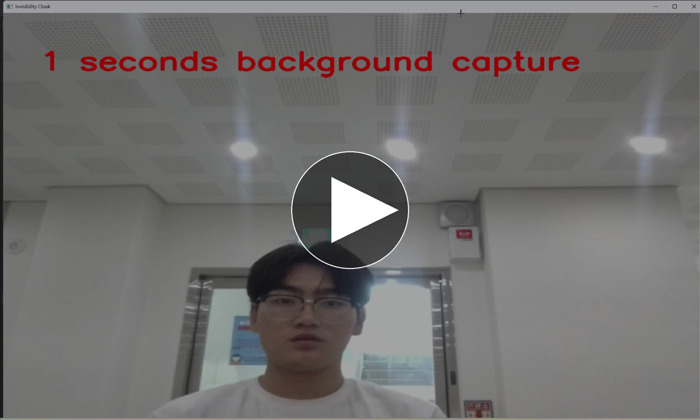
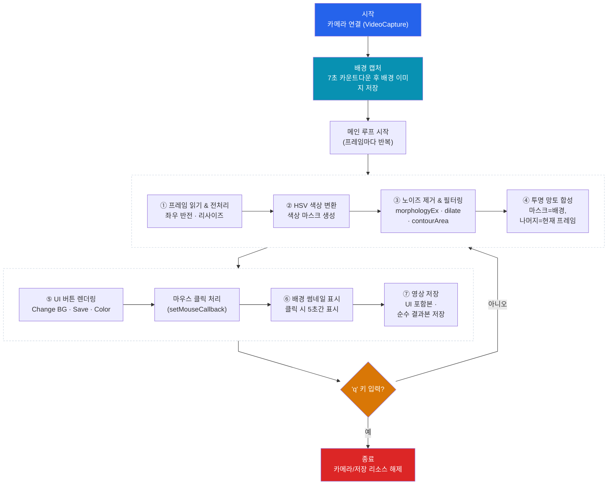

# 실시간 투명 망토 (Invisibility Cloak) - OpenCV & Python

컴퓨터 비전 6조 프로젝트. OpenCV와 Python으로 특정 색상의 물체를 인식해서, 그 부분을 미리 저장해둔 배경 이미지로 실시간 대체하는 "투명 망토" 효과를 구현했습니다. 색상이 검출된 영역만 배경으로 바뀌기 때문에, 마치 사람이 화면에서 사라지는 것처럼 보이는 영상을 실시간으로 만들 수 있습니다.

## 실행 데모 영상

[](https://youtu.be/Kox0OEBIBek)

썸네일을 클릭하면 유튜브(일부 공개)에서 원본 화질 그대로 재생됩니다.

## 블록도 (전체 동작 흐름)

아래 블록도는 프로그램이 시작부터 종료까지 어떤 순서로 동작하는지, 그리고 매 프레임마다 어떤 처리 블록들을 거치는지를 보여줍니다. 이 그림의 각 블록이 바로 아래 "주요 기능" 7가지에 그대로 대응되니, 먼저 전체 흐름을 훑어본 뒤 기능 설명을 읽으면 이해하기 쉽습니다.



## 주요 기능

이 프로젝트는 7가지 기능으로 구성되어 있으며, 위 블록도의 ①~⑦번 블록에 각각 대응합니다.

1. **카메라 연결 및 프레임 처리** — `cv2.VideoCapture(0)`으로 카메라를 열고, `flip()`/`resize()`로 좌우 반전과 해상도를 맞춥니다.
2. **HSV 색상 변환 및 특정 색상 추출** — RGB는 색 분리가 약해 `cvtColor()`로 HSV로 바꾼 뒤 `inRange()`로 빨강/초록/파랑 중 선택한 색상만 검출합니다. (빨강은 색상환의 양 끝에 걸쳐 있어 두 범위를 합쳐서 처리합니다.)
3. **노이즈 제거 및 객체 필터링** — `morphologyEx()`(열림 연산)와 `dilate()`로 마스크의 잡티를 정리하고, `findContours()`/`contourArea()`로 너무 작은 객체는 제외합니다.
4. **투명 망토 합성** — 마스크를 기준으로 망토 영역은 배경 이미지, 나머지는 원본 프레임을 유지하도록 `bitwise_and()`로 분리한 뒤 `add()`로 합성합니다.
5. **사이드바 UI 버튼** — 화면 왼쪽에 배경 재촬영(Change BG), 스크린샷 저장(Save Screenshot), 배경 미리보기(B Picture Show), 색상 선택(Red/Green/Blue) 버튼을 직접 그려서 `setMouseCallback()`으로 클릭을 처리합니다.
6. **배경 썸네일 표시** — B Picture Show 버튼을 누르면 현재 저장된 배경을 화면 우하단에 5초간 축소 표시해, 어떤 배경으로 합성 중인지 확인할 수 있습니다.
7. **영상 저장** — `cv2.VideoWriter()`로 UI가 포함된 전체 화면과, UI 없이 투명망토 효과만 담은 영상 두 가지를 각각 저장합니다.

## 폴더 구조

```
OpenCV-Invisibility-Cloak/
├── assets/            # README에 쓰이는 이미지 (데모 영상 썸네일)
├── docs/              # 발표 자료 (슬라이드 PDF/PPTX, 발표 대본 HWP)
├── src/               # 실행 가능한 파이썬 소스코드 + 코드 상세 설명
└── requirements.txt   # 의존 라이브러리 목록 (opencv-python, numpy)
```

| 폴더 | 설명 |
|:---:|---|
| [](./assets) | README에서 쓰는 [데모 영상 썸네일](./assets/thumbnail.jpg) 이미지 |
| [](./docs) | 발표 슬라이드([PDF](./docs/6조%20최종%20발표.pdf), [PPTX](./docs/6조%20최종발표.pptx))와 발표 대본([HWP](./docs/투명망토%20발표%20대본.hwp)) |
| [](./src) | [`invisibility_cloak.py`](./src/invisibility_cloak.py) 소스코드와 [`README.md`](./src/README.md)(코드 상세 설명). 원래 PDF/HWP 원본도 제출됐지만 `.py`와 완전히 동일해 중복 없이 실행 파일 하나만 남겼습니다. |

> 💡 폴더 이름을 클릭하면 해당 폴더로 바로 이동합니다.

## 실행 방법

아래 0번부터 5번까지 순서대로 따라 하면 프로그램을 실행할 수 있습니다. 각 항목을 클릭하면 펼쳐집니다.

<details>
<summary><strong>0. 사전 준비물</strong></summary>

- [Git](https://git-scm.com/downloads)
- Python 3.8 이상
- 웹캠(내장/외장 카메라)이 연결된 컴퓨터

</details>

<details>
<summary><strong>1. 저장소 클론(다운로드)</strong></summary>

터미널(Windows는 명령 프롬프트/PowerShell, Mac/Linux는 터미널)을 열고 아래 명령을 순서대로 입력합니다.

```bash
git clone https://github.com/2101080JUNGJINYOUNG/OpenCV-Invisibility-Cloak.git
cd OpenCV-Invisibility-Cloak
```

> Git이 없다면 저장소 페이지 오른쪽 위 **Code → Download ZIP** 버튼으로도 받을 수 있습니다.

</details>

<details>
<summary><strong>2. (선택) 가상환경 만들기</strong></summary>

다른 프로젝트와 라이브러리가 섞이지 않도록 가상환경 사용을 권장합니다. 생략하고 바로 3단계로 넘어가도 됩니다.

```bash
python -m venv venv

# Windows
venv\Scripts\activate

# Mac / Linux
source venv/bin/activate
```

</details>

<details>
<summary><strong>3. 의존성 설치</strong></summary>

이 프로젝트는 `opencv-python`, `numpy` 두 라이브러리만 사용하며, [`requirements.txt`](./requirements.txt)에 정리되어 있습니다.

```bash
pip install -r requirements.txt
```

</details>

<details>
<summary><strong>4. 실행</strong></summary>

```bash
python src/invisibility_cloak.py
```

실행하면 7초 카운트다운 후 현재 화면이 배경으로 저장되므로, 이 시간 동안 카메라 앞에서 비켜 있어야 합니다. 이후 빨간색(기본값) 물체를 카메라에 비추면 그 부분이 배경으로 대체됩니다. 왼쪽 사이드바 버튼으로 배경 재촬영, 색상 변경, 스크린샷 저장, 배경 미리보기를 조작할 수 있고, `q` 키를 누르면 영상 저장 후 종료됩니다.

</details>

<details>
<summary><strong>5. 코드 수정 후 GitHub에 반영하기(커밋 & 푸시)</strong></summary>

직접 코드를 수정해보고 싶다면, 클론한 폴더 안에서 다음 순서로 변경 사항을 GitHub에 올릴 수 있습니다.

```bash
# 1) 현재 어떤 파일이 바뀌었는지 확인
git status

# 2) 바뀐 파일을 스테이징(커밋 대상으로 등록)
git add .

# 3) 커밋 메시지와 함께 기록 남기기
git commit -m "수정 내용 요약"

# 4) GitHub 저장소로 업로드(푸시)
git push
```

처음 `git push`를 실행하면 GitHub 계정 로그인을 요구할 수 있습니다. 이때는 비밀번호 대신 [Personal Access Token](https://docs.github.com/ko/authentication/keeping-your-account-and-data-secure/managing-your-personal-access-tokens)을 발급받아 입력해야 합니다(2021년 이후 GitHub는 비밀번호 인증을 지원하지 않습니다). 본인이 만든 저장소가 아니라면, GitHub에서 **Fork**(내 계정으로 복사) 후 위 과정을 진행하고, 원본 저장소에 반영하고 싶을 때 **Pull Request**를 보내면 됩니다.

</details>

## 코드 상세 설명

함수별 설명과 메인 루프 처리 순서 등 구현 디테일은 [`src/README.md`](./src/README.md)에 정리했습니다.

## 배운 것 / 깨달은 것 / 성취한 것

이 프로젝트는 이전에 정리했던 [`OpenCV-Practice`](https://github.com/2101080JUNGJINYOUNG/OpenCV-Practice)(C++, OpenCV 기초 실습) 레포에서 다진 개념을 실제로 동작하는 실시간 프로그램으로 옮겨보는 과정이었습니다. VideoCapture·VideoWriter·마우스 콜백을 다뤄봤던 실습이 이번 프로젝트의 카메라 입력과 UI 버튼 클릭 처리로 그대로 이어졌고, 다만 이번엔 "이론으로 아는 것"을 손으로 직접 검증해야 하는 순간이 훨씬 많았습니다.

처음엔 `cv2.inRange()`로 빨간색 범위 하나만 지정하면 될 줄 알았는데, 막상 빨간색 물체를 카메라에 비추자 마스크에 구멍이 숭숭 뚫렸습니다. 빨강이 HSV 색상환의 0° 근처와 180° 근처 양쪽에 걸쳐 있다는 걸 그제서야 깨닫고 `[0,120,70]~[10,255,255]`와 `[170,120,70]~[180,255,255]` 두 범위를 더해서야 온전한 마스크를 얻을 수 있었습니다.

마스크를 만든 직후엔 "다 됐다"고 생각했지만, 실제로는 잡음 때문에 검출 영역 가장자리가 지저분하게 깜빡였습니다. `cv2.morphologyEx(..., MORPH_OPEN)`으로 작은 점을 지우고 `cv2.dilate()`로 경계를 살짝 넓힌 다음, 그래도 남는 덩어리는 `cv2.findContours()`와 `cv2.contourArea() < 2000` 조건으로 걸러내고 나서야 깨끗한 결과를 얻었습니다. 합성 자체는 `bitwise_and`로 검출된 영역엔 배경을, 나머지엔 현재 프레임을 남긴 뒤 `cv2.add()`로 더하는 방식인데, 두 마스크가 서로 겹치지 않도록만 설계하면 복잡한 알파 블렌딩 없이도 비트 연산만으로 합성이 가능하다는 걸 이해했습니다.

UI 쪽에서는 `setMouseCallback()`으로 버튼 클릭을 처음 구현했을 때 클릭한 버튼이 계속 강조 색으로 남아있거나 반대로 반응이 없는 문제를 겪었습니다. `clicked_button`과 `clicked_time`을 따로 두고 0.3초 후 자동으로 원래 색으로 되돌리는 로직을 넣고 나서야, 이벤트 기반 프로그래밍에서는 "지금 눌렸는가"뿐 아니라 "언제까지 눌린 상태로 보여줄 것인가"까지 직접 관리해야 한다는 걸 알게 됐습니다. 영상 저장에서는 `out.write(combined)`와 `out2.write(combined[:, sidebar_width:])`처럼 같은 프레임도 배열을 어떻게 슬라이싱하느냐에 따라 UI 포함본과 순수 결과본으로 갈린다는 걸 확인하면서, 시연용 결과물과 실제 처리 결과물을 분리해서 관리하는 감각을 익혔습니다.

전체적으로 이 프로젝트는 OpenCV 함수 몇 개를 외우는 게 아니라, 색이 어떻게 마스크로 바뀌고 그 마스크가 비트 연산을 거쳐 하나의 프레임으로 합쳐지는지를 실패와 재시도를 반복하며 확인해 나가는 과정이었습니다.
