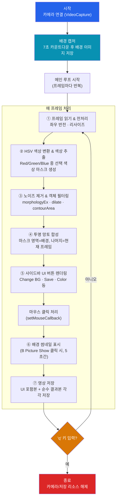

# 실시간 투명 망토 (Invisibility Cloak) - OpenCV & Python

컴퓨터 비전 6조 프로젝트. OpenCV와 Python으로 특정 색상의 천을 인식해서, 그 부분을 미리 저장해둔 배경 이미지로 실시간 대체하는 "투명 망토" 효과를 구현했습니다. 색상이 검출된 영역만 배경으로 바뀌기 때문에, 마치 사람이 화면에서 사라지는 것처럼 보이는 영상을 실시간으로 만들 수 있습니다.

## 실행 데모 영상

<video src="https://github.com/2101080JUNGJINYOUNG/OpenCV-Invisibility-Cloak/releases/download/v1.0.0/default.mp4" controls width="720">
  브라우저가 video 태그를 지원하지 않는 경우, <a href="https://github.com/2101080JUNGJINYOUNG/OpenCV-Invisibility-Cloak/releases/download/v1.0.0/default.mp4">여기</a>에서 다운로드해서 확인하세요.
</video>

## 블록도 (전체 동작 흐름)

아래 블록도는 프로그램이 시작부터 종료까지 어떤 순서로 동작하는지, 그리고 매 프레임마다 어떤 처리 블록들을 거치는지를 보여줍니다. 이 그림의 각 블록이 바로 아래 "주요 기능" 7가지에 그대로 대응되니, 먼저 전체 흐름을 훑어본 뒤 기능 설명을 읽으면 이해하기 쉽습니다.



## 주요 기능

이 프로젝트는 7가지 기능으로 구성되어 있으며, 위 블록도의 ①~⑦번 블록에 각각 대응합니다.

1. **카메라 연결 및 프레임 처리** — `cv2.VideoCapture(0)`으로 카메라를 열고, `flip()`/`resize()`로 좌우 반전과 해상도를 맞춥니다.
2. **HSV 색상 변환 및 특정 색상 추출** — RGB는 색 분리가 약해 `cvtColor()`로 HSV로 바꾼 뒤 `inRange()`로 빨강/초록/파랑 중 선택한 색상만 검출합니다. (빨강은 색상환의 양 끝에 걸쳐 있어 두 범위를 합쳐서 처리합니다.)
3. **노이즈 제거 및 객체 필터링** — `morphologyEx()`(열림 연산)와 `dilate()`로 마스크의 잡티를 정리하고, `findContours()`/`contourArea()`로 너무 작은 객체는 제외합니다.
4. **투명 망토 합성** — 마스크를 기준으로 망토 영역은 배경 이미지, 나머지는 원본 프레임을 유지하도록 `bitwise_and()`로 분리한 뒤 `add()`로 합성합니다.
5. **사이드바 UI 버튼** — 화면 왼쪽에 배경 재촬영(Change BG), 스크린샷 저장(Save Screenshot), 배경 미리보기(B Picture Show), 색상 선택(Red/Green/Blue) 버튼을 직접 그려서 `setMouseCallback()`으로 클릭을 처리합니다.
6. **배경 썸네일 표시** — B Picture Show 버튼을 누르면 현재 저장된 배경을 화면 우하단에 5초간 축소 표시해, 어떤 배경으로 합성 중인지 확인할 수 있습니다.
7. **영상 저장** — `cv2.VideoWriter()`로 UI가 포함된 전체 화면과, UI 없이 투명망토 효과만 담은 영상 두 가지를 각각 저장합니다.

## 폴더 구조

```
OpenCV-Invisibility-Cloak/
├── docs/    # 발표 자료 (슬라이드 PDF/PPTX, 발표 대본 HWP)
└── src/     # 실행 가능한 파이썬 소스코드
```

- [`docs/`](./docs) — 발표 슬라이드([PDF](./docs/6조%20최종%20발표.pdf), [PPTX](./docs/6조%20최종발표.pptx))와 발표 대본([HWP](./docs/투명망토%20발표%20대본.hwp))
- [`src/`](./src) — [`invisibility_cloak.py`](./src/invisibility_cloak.py) 하나만 있습니다. 원래 코드 원본이 PDF/HWP로도 제출되어 있었는데, `.py`와 완전히 동일한 코드라 중복을 없애고 실행 파일 하나만 남겼습니다. 코드 전체 내용과 구현 방식은 바로 아래 "코드 상세 설명" 섹션에 기능별로 자세히 정리해뒀습니다.

## 실행 방법

```bash
pip install opencv-python numpy
python src/invisibility_cloak.py
```

실행하면 7초 카운트다운 후 현재 화면이 배경으로 저장되므로, 이 시간 동안 카메라 앞에서 비켜 있어야 합니다. 이후 빨간색(기본값) 천을 몸에 두르면 그 부분이 배경으로 대체됩니다. 왼쪽 사이드바 버튼으로 배경 재촬영, 색상 변경, 스크린샷 저장, 배경 미리보기를 조작할 수 있고, `q` 키를 누르면 영상 저장 후 종료됩니다.

## 코드 상세 설명

전체 코드는 [`src/invisibility_cloak.py`](./src/invisibility_cloak.py)에 있습니다. 아래는 함수 단위 설명과, 메인 루프가 한 프레임을 처리하는 전체 흐름을 단계별로 정리한 것입니다.

### 함수별 설명

- **`get_mask(hsv)`** — 현재 선택된 색상(`selected_color`)에 맞는 HSV 범위로 `cv2.inRange()`를 적용해 이진 마스크(해당 색상 영역=255, 나머지=0)를 만듭니다. 빨강은 HSV 색상환에서 0° 부근과 180° 부근 두 군데에 걸쳐 있기 때문에, `[0,120,70]~[10,255,255]`와 `[170,120,70]~[180,255,255]` 두 범위를 만들어 더해줍니다. 초록/파랑은 각각 한 범위(`[40,50,50]~[85,255,255]`, `[85,110,110]~[130,255,255]`)로 충분합니다.
- **`fit_text_to_button(text, w, h, ...)`** — `cv2.getTextSize()`로 글자 크기를 재보면서, 버튼 폭/높이보다 커지지 않을 때까지 `scale`을 0.01씩 줄여나갑니다. 버튼 라벨 길이가 달라도 항상 버튼 안에 딱 맞게 들어가도록 하는 자동 맞춤 함수입니다.
- **`capture_background()`** — 7초 카운트다운(1초마다 화면에 남은 초를 빨간 글씨로 표시)을 진행한 뒤, 마지막 프레임을 배경으로 저장합니다. 이 함수가 끝나면 `(배경 이미지, 촬영 시각)` 튜플을 반환하며, 프로그램 시작 시 한 번, 그리고 사용자가 "Change BG" 버튼을 누를 때마다 다시 호출됩니다.
- **`draw_button(sidebar, y, label, selected)`** — 사이드바 이미지 위에 사각형 버튼과 중앙 정렬된 라벨을 그립니다. `selected=True`이면 버튼 색이 회색(`(68,68,68)`)에서 빨강 계열(`(100,100,255)`)로 바뀌어 클릭된 상태를 보여줍니다.
- **`mouse_callback(event, x, y, flags, param)`** — `cv2.setMouseCallback()`으로 등록되는 콜백입니다. 좌클릭 좌표가 사이드바 영역(`10 <= x <= sidebar_width-10`) 안에 있고, 6개 버튼(Change BG / Save Screenshot / B Picture Show / Red / Green / Blue) 중 하나의 y좌표 범위에 들어오면 해당 동작을 실행합니다. 예: Save Screenshot을 누르면 현재 합성 결과(`combined`)를 타임스탬프 파일명으로 `cv2.imwrite()` 저장합니다.

### 메인 루프 처리 순서 (프레임 1장당)

1. **카메라 연결** — `cap = cv2.VideoCapture(0)`으로 내장/외장 카메라를 연결합니다.
2. **배경 캡처 시작** — `capture_background()`를 호출해 7초 딜레이 후 사람이 없는 배경을 저장합니다.
3. **메인 루프 시작** — `while cap.isOpened():` 안에서 아래 과정이 매 프레임 반복됩니다.
4. **프레임 읽기 및 전처리** — `ret, frame = cap.read()` 후 `cv2.flip(frame, 1)`로 좌우 반전(거울 모드), `cv2.resize()`로 960×720 해상도로 통일합니다.
5. **HSV 색공간 변환** — `hsv = cv2.cvtColor(frame, cv2.COLOR_BGR2HSV)`. RGB보다 색상(H) 성분이 조명 변화에 덜 민감해서 색 검출이 쉬워집니다.
6. **색상 마스크 생성** — `mask = get_mask(hsv)`로 선택된 색상 범위만 흰색, 나머지는 검정인 이진 마스크를 만듭니다.
7. **노이즈 제거** — `cv2.morphologyEx(mask, cv2.MORPH_OPEN, ...)`(침식 후 팽창 = 열림 연산)으로 작은 점 잡음을 없애고, `cv2.dilate()`로 남은 영역의 경계를 살짝 넓혀 자연스럽게 만듭니다.
8. **작은 객체 제거** — `cv2.findContours()`로 마스크 안의 윤곽선들을 찾고, `cv2.contourArea(cnt) < 2000`인 너무 작은 영역은 `cv2.drawContours(..., -1, 0, -1)`로 마스크에서 지워버립니다.
9. **반전 마스크 생성** — `mask_inv = cv2.bitwise_not(mask)`. 망토가 아닌 영역(원본 프레임을 그대로 보여줘야 하는 부분)을 나타냅니다.
10. **망토 영역에 배경 채우기** — `res1 = cv2.bitwise_and(current_bg, current_bg, mask=mask)`로, 저장해둔 배경 이미지에서 마스크(망토) 영역만 잘라냅니다.
11. **비망토 영역에 현재 프레임 유지** — `res2 = cv2.bitwise_and(frame, frame, mask=mask_inv)`로, 현재 프레임에서 망토가 아닌 부분만 잘라냅니다.
12. **두 영상 합성** — `result = cv2.add(res1, res2)`. 두 영역이 서로 겹치지 않는 마스크이므로 단순히 더하기만 해도 자연스럽게 합쳐지고, 이 결과가 "망토가 투명해진" 화면입니다.
13. **사이드바 생성 및 버튼 표시** — 흰색 사이드바(`np.ones(...)*255`)를 만들고 `draw_button()`으로 6개 버튼(+"Color Change" 제목)을 그립니다. 최근 0.3초 안에 클릭된 버튼은 `clicked_button`으로 표시되어 색이 강조됩니다.
14. **현재 상태 텍스트 표시** — 사이드바 하단에 `fit_text_to_button()`으로 크기를 맞춘 "Color: Red" 같은 현재 색상, "BG: HH:MM:SS" 같은 배경 촬영 시각을 표시합니다.
15. **화면 합치기** — 사이드바(왼쪽)와 합성 결과(오른쪽)를 하나의 `combined` 이미지로 나란히 붙입니다.
16. **배경 썸네일 표시(선택 시)** — "B Picture Show" 버튼을 누르면 `picture_show_start_time`부터 5초 동안, 저장된 배경을 축소한 썸네일을 화면 우하단(`combined[-th-10:-10, -tw-10:-10]`)에 겹쳐 보여줍니다.
17. **마우스 클릭 이벤트 처리** — `mouse_callback()`이 버튼 클릭을 감지해 배경 재촬영, 색상 변경, 스크린샷 저장 등을 즉시 반영합니다.
18. **영상 저장** — `out.write(combined)`(UI 포함 전체 화면)와 `out2.write(combined[:, sidebar_width:])`(UI 없이 투명망토 결과만) 두 개의 `cv2.VideoWriter`에 각각 프레임을 기록합니다.
19. **종료 처리** — `cv2.waitKey(1) & 0xFF == ord('q')`이면 루프를 빠져나와 `cap.release()`, `out.release()`, `out2.release()`, `cv2.destroyAllWindows()`로 모든 리소스를 정리하고 프로그램을 종료합니다.

## 배운 것 / 깨달은 것 / 성취한 것

- HSV 색공간이 RGB보다 색상 분리에 훨씬 유리하다는 것을 직접 확인했고, 특히 빨간색처럼 색상환의 양 끝에 걸쳐 있는 색은 두 개의 `inRange` 범위를 합쳐야 한다는 점을 배웠습니다.
- 카메라에서 들어오는 실시간 영상은 잡음이 많아서, 마스크만 만드는 것으로는 부족하고 형태학적 연산(열림, 팽창)과 컨투어 면적 필터링을 함께 써야 깔끔한 결과가 나온다는 것을 실습을 통해 체감했습니다.
- `bitwise_and`/`bitwise_not`/`add` 같은 비트 연산만으로 이미지 합성을 구현할 수 있다는 점이 흥미로웠고, 마스크 기반 합성의 원리를 이해하는 계기가 되었습니다.
- OpenCV의 기본 도형/텍스트 함수(`rectangle`, `putText`, `getTextSize`)와 `setMouseCallback`만으로 버튼 클릭이 가능한 UI를 직접 구현하면서, 별도 GUI 프레임워크 없이도 인터랙티브한 영상 프로그램을 만들 수 있다는 것을 경험했습니다.
- 결과 영상을 UI 포함/미포함 두 가지로 나눠 저장하도록 설계하면서, 시연용 결과물과 순수 처리 결과물을 구분해서 관리하는 습관을 익혔습니다.
