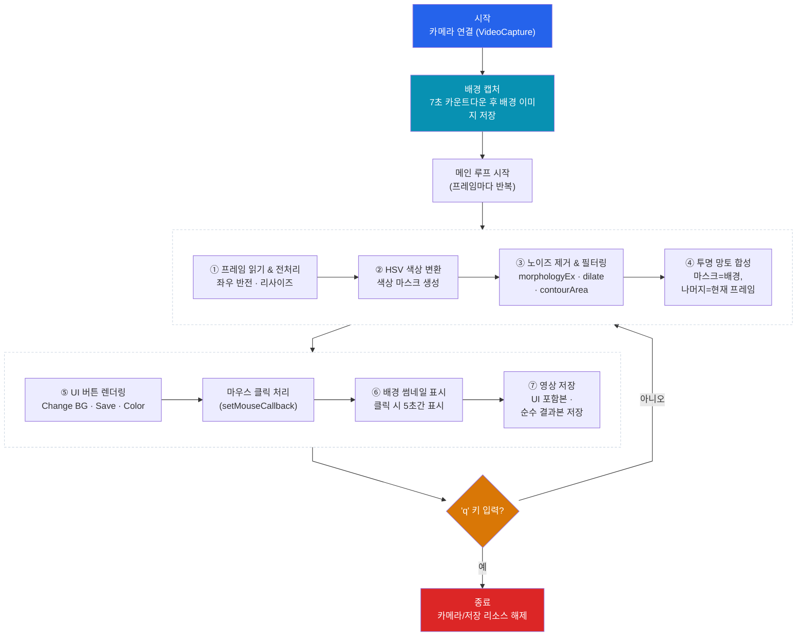

# 실시간 투명 망토 (Invisibility Cloak) - OpenCV & Python

컴퓨터 비전 6조 프로젝트. OpenCV와 Python으로 특정 색상의 천을 인식해서, 그 부분을 미리 저장해둔 배경 이미지로 실시간 대체하는 "투명 망토" 효과를 구현했습니다. 색상이 검출된 영역만 배경으로 바뀌기 때문에, 마치 사람이 화면에서 사라지는 것처럼 보이는 영상을 실시간으로 만들 수 있습니다.

## 실행 데모 영상

[](https://youtu.be/Kox0OEBIBek)

썸네일을 클릭하면 유튜브(일부 공개)에서 원본 화질 그대로 재생됩니다.

## 블록도 (전체 동작 흐름)

아래 블록도는 프로그램이 시작부터 종료까지 어떤 순서로 동작하는지, 그리고 매 프레임마다 어떤 처리 블록들을 거치는지를 보여줍니다. 이 그림의 각 블록이 바로 아래 "주요 기능" 7가지에 그대로 대응되니, 먼저 전체 흐름을 훑어본 뒤 기능 설명을 읽으면 이해하기 쉽습니다.



## 주요 기능

이 프로젝트는 7가지 기능으로 구성되어 있으며, 위 블록도의 ①~⑦번 블록에 각각 대응합니다.

1. **카메라 연결 및 프레임 처리** — `cv2.VideoCapture(0)`으로 카메라를 열고, `flip()`/`resize()`로 좌우 반전과 해상도를 맞춥니다.
2. **HSV 색상 변환 및 특정 색상 추출** — RGB는 색 분리가 약해 `cvtColor()`로 HSV로 바꾼 뒤 `inRange()`로 빨강/초록/파랑 중 선택한 색상만 검출합니다. (빨강은 색상환의 양 끝에 걸쳐 있어 두 범위를 합쳐서 처리합니다.)
3. **노이즈 제거 및 객체 필터링** — `morphologyEx()`(열림 연산)와 `dilate()`로 마스크의 잡티를 정리하고, `findContours()`/`contourArea()`로 너무 작은 객체는 제외합니다.
4. **투명 망토 합성** — 마스크를 기준으로 망토 영역은 배경 이미지, 나머지는 원본 프레임을 유지하도록 `bitwise_and()`로 분리한 뒤 `add()`로 합성합니다.
5. **사이드바 UI 버튼** — 화면 왼쪽에 배경 재촬영(Change BG), 스크린샷 저장(Save Screenshot), 배경 미리보기(B Picture Show), 색상 선택(Red/Green/Blue) 버튼을 직접 그려서 `setMouseCallback()`으로 클릭을 처리합니다.
6. **배경 썸네일 표시** — B Picture Show 버튼을 누르면 현재 저장된 배경을 화면 우하단에 5초간 축소 표시해, 어떤 배경으로 합성 중인지 확인할 수 있습니다.
7. **영상 저장** — `cv2.VideoWriter()`로 UI가 포함된 전체 화면과, UI 없이 투명망토 효과만 담은 영상 두 가지를 각각 저장합니다.

## 폴더 구조

```
OpenCV-Invisibility-Cloak/
├── assets/   # README에 쓰이는 이미지 (데모 영상 썸네일)
├── docs/     # 발표 자료 (슬라이드 PDF/PPTX, 발표 대본 HWP)
└── src/      # 실행 가능한 파이썬 소스코드 + 코드 상세 설명
```

| 폴더 | 바로가기 | 설명 |
|:---:|:---:|---|
| **`assets/`** | [](./assets) | README에서 쓰는 [데모 영상 썸네일](./assets/thumbnail.jpg) 이미지 |
| **`docs/`** | [](./docs) | 발표 슬라이드([PDF](./docs/6조%20최종%20발표.pdf), [PPTX](./docs/6조%20최종발표.pptx))와 발표 대본([HWP](./docs/투명망토%20발표%20대본.hwp)) |
| **`src/`** | [](./src) | [`invisibility_cloak.py`](./src/invisibility_cloak.py) 소스코드와 [`README.md`](./src/README.md)(코드 상세 설명) |

`src/`에는 원래 PDF/HWP로도 제출됐던 코드 원본이 있었는데, `.py`와 완전히 동일한 코드라 중복을 없애고 실행 파일 하나만 남겼습니다.

## 실행 방법

```bash
pip install opencv-python numpy
python src/invisibility_cloak.py
```

실행하면 7초 카운트다운 후 현재 화면이 배경으로 저장되므로, 이 시간 동안 카메라 앞에서 비켜 있어야 합니다. 이후 빨간색(기본값) 천을 몸에 두르면 그 부분이 배경으로 대체됩니다. 왼쪽 사이드바 버튼으로 배경 재촬영, 색상 변경, 스크린샷 저장, 배경 미리보기를 조작할 수 있고, `q` 키를 누르면 영상 저장 후 종료됩니다.

## 코드 상세 설명

함수별 설명과 메인 루프 처리 순서 등 구현 디테일은 [`src/README.md`](./src/README.md)에 정리했습니다.

## 배운 것 / 깨달은 것 / 성취한 것

- HSV 색공간이 RGB보다 색상 분리에 훨씬 유리하다는 것을 직접 확인했고, 특히 빨간색처럼 색상환의 양 끝에 걸쳐 있는 색은 두 개의 `inRange` 범위를 합쳐야 한다는 점을 배웠습니다.
- 카메라에서 들어오는 실시간 영상은 잡음이 많아서, 마스크만 만드는 것으로는 부족하고 형태학적 연산(열림, 팽창)과 컨투어 면적 필터링을 함께 써야 깔끔한 결과가 나온다는 것을 실습을 통해 체감했습니다.
- `bitwise_and`/`bitwise_not`/`add` 같은 비트 연산만으로 이미지 합성을 구현할 수 있다는 점이 흥미로웠고, 마스크 기반 합성의 원리를 이해하는 계기가 되었습니다.
- OpenCV의 기본 도형/텍스트 함수(`rectangle`, `putText`, `getTextSize`)와 `setMouseCallback`만으로 버튼 클릭이 가능한 UI를 직접 구현하면서, 별도 GUI 프레임워크 없이도 인터랙티브한 영상 프로그램을 만들 수 있다는 것을 경험했습니다.
- 결과 영상을 UI 포함/미포함 두 가지로 나눠 저장하도록 설계하면서, 시연용 결과물과 순수 처리 결과물을 구분해서 관리하는 습관을 익혔습니다.
